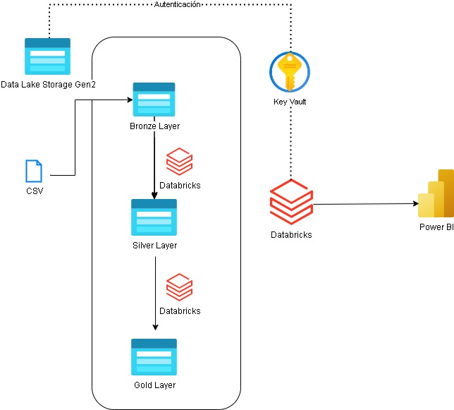

# 📊 E-commerce Data Lakehouse Project with Azure Databricks & Power BI

## 📝 Project Overview

This project implements a **Data Lakehouse solution** on Microsoft Azure to process and analyze e-commerce transaction data. It leverages a modern **Medallion architecture** (Bronze, Silver, Gold layers) and utilizes key Azure services for data ingestion, transformation, storage, and visualization.

The primary goal is to transform raw transactional data into structured, high-quality information. This refined data then enables powerful analytics and **Business Intelligence (BI) insights** into sales performance, customer behavior, and product trends, all visualized effectively through **Power BI**.

---

## 🚀 Solution Architecture

**Key Components:**
* **Azure Data Lake Storage Gen2 (ADLS Gen2):** Scalable, hierarchical storage for all Data Lakehouse layers.
* **Azure Databricks:** A unified analytics platform powered by Apache Spark, used for orchestrating and executing data transformations (ETL/ELT) across the layers..
* **Azure Key Vault:** Securely manages and stores sensitive credentials and secrets, ensuring secure access to Azure resources.
* **Azure Event Hubs (Planeado/Futuro):** For real-time data ingestion (streaming)
* **Microsoft Power BI:** A leading Business Intelligence tool for creating interactive dashboards and reports, consuming data from the Gold layer.

## 🗄️ Estructura del Data Lakehouse (Arquitectura Medallion)

El proyecto sigue una arquitectura de Medallion, con las siguientes capas:

* **Raw / Bronze Layer:** Datos crudos, sin modificar, tal como se ingesan. (Ej. `ecommerce-customers.csv` original).
* **Silver Layer:** Datos limpios, transformados y enriquecidos. Esquema aplicado, nulos y duplicados manejados, tipos de datos corregidos.
* **Gold Layer:** Datos agregados, preparados para consumo directo por **Business Intelligence (BI)** y análisis de negocio, optimizados para consultas de rendimiento (la capa que Power BI consumirá directamente).

---

## ⚙️ Tecnologías Utilizadas

* **Cloud Platform:** Microsoft Azure
* **Data Storage:** Azure Data Lake Storage Gen2
* **Data Processing & Orchestration:** Azure Databricks (Apache Spark, Delta Lake)
* **Secret Management:** Azure Key Vault
* **Streaming Ingestion (Planned):** Azure Event Hubs
* **Business Intelligence & Visualization:** Microsoft Power BI
* **Programming Languages:** Python (PySpark)

---

## 📦 Origen de los Datos

Los datos utilizados en este proyecto corresponden a un dataset de transacciones de e-commerce.

* **Fuente:** [https://www.kaggle.com/datasets/carrie1/ecommerce-data/code?datasetId=1985)](https://www.kaggle.com/datasets/carrie1/ecommerce-data/code?datasetId=1985)
* **Archivo de ejemplo:** `ecommerce-customers.csv` (contiene `InvoiceNo`, `StockCode`, `Description`, `Quantity`, `InvoiceDate`, `UnitPrice`, `CustomerID`, `Country`).

---

## 🛠️ Configuración y Prerequisitos

Para replicar este proyecto, necesitarás:

1.  Una suscripción de Azure activa.
2.  Un Workspace de Azure Databricks.
3.  Una cuenta de Azure Data Lake Storage Gen2.
4.  Un Azure Key Vault.
5.  Un Service Principal (App Registration) de Azure AD con los permisos adecuados:
    * **Data Lake:** Rol de "Storage Blob Data Contributor" en ADLS Gen2.
    * **Key Vault:** Rol de "Key Vault Secrets User" en el Key Vault.
6.  Un Secret Scope en Databricks vinculado a tu Key Vault.
    * Asegúrate de que los secretos `client-id`, `client-secret`, `tenant-id` estén almacenados en Key Vault y sean accesibles desde el Secret Scope.
7.  Un cluster de Databricks configurado (ej. modo "Single User" con el Service Principal asignado).
8.  **Power BI Desktop** instalado si deseas replicar la fase de visualización.

**Nota importante:** ¡Nunca subas tus credenciales o secretos directamente a GitHub! Para eso utilizamos Azure Key Vault.

---

## 🚀 Pasos de Ejecución

1.  **Carga de datos raw:** Sube el archivo `ecommerce-customers.csv` (o el dataset `online_tomretail_transactions/data.csv`) a la capa `bronze` de tu ADLS Gen2.
2.  **Abrir Notebook en Databricks:** Importa los notebooks proporcionados (`notebooks/01_Raw_to_Silver.ipynb`, `notebooks/02_Silver_to_Gold_Aggregation.ipynb`, etc.) a tu Workspace de Databricks.
3.  **Adjuntar al Cluster:** Asegúrate de que el notebook esté adjunto a tu cluster de Databricks.
4.  **Ejecutar celdas:** Sigue el orden de las celdas en el notebook:
    * **Celda 1 (Configuración):** Establece las configuraciones de Spark para la conexión a ADLS Gen2 usando Key Vault.
    * **Celda 2 (Lectura Raw):** Lee los datos del CSV desde la capa `bronze`.
    * **Celda 3 (Limpieza Silver):** Aplica transformaciones de limpieza y prepara los datos para la capa `silver`.
    * *(Agrega más pasos a medida que construyamos las capas Silver y Gold y los guardemos, incluyendo cómo Power BI se conectaría a la capa Gold)*

---

## 💡 Insights y Aprendizajes (Placeholder - Lo llenaremos al final)

* [Ej. Descripción de la calidad de datos encontrada: nulos en CustomerID, etc.]
* [Ej. Patrones de ventas por país o por fecha.]
* [Ej. Cómo se manejaron las transacciones canceladas.]
* [Ej. Métricas clave generadas para el análisis en Power BI.]

---

## 🔮 Futuras Mejoras

* Implementación de la ingesta de datos en streaming usando Azure Event Hubs.
* Creación de **dashboards interactivos en Power BI** consumiendo la capa Gold.
* Automatización del pipeline con Azure Data Factory o Databricks Workflows.
* Enriquecimiento de datos con otras fuentes.

---

## 📧 Contacto

* **Braulio Tomas Fernandez Trejo**
* **LinkedIn:** [Enlace a tu perfil de LinkedIn]
* **GitHub:** [Enlace a tu perfil de GitHub (este repositorio es parte de él)]

---

## 📄 Licencia

Este proyecto está bajo la Licencia MIT. Ver el archivo [LICENSE](LICENSE) para más detalles.
