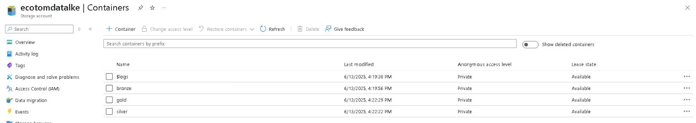

# 📊 E-commerce Data Lakehouse Project with Azure Databricks & Power BI

## 📝 Project Overview

This project implements a **Data Lakehouse solution** on Microsoft Azure to process and analyze e-commerce transaction data. It leverages a modern **Medallion architecture** (Bronze, Silver, Gold layers) and utilizes key Azure services for data ingestion, transformation, storage, and visualization.

The primary goal is to transform raw transactional data into structured, high-quality information. This refined data then enables powerful analytics and **Business Intelligence (BI) insights** into sales performance, customer behavior, and product trends, all visualized effectively through **Power BI**.

---

## 🚀 Solution Architecture

**Key Components:**
* **Azure Data Lake Storage Gen2 (ADLS Gen2):** Scalable, hierarchical storage for all Data Lakehouse layers.
* **Azure Databricks:** A unified analytics platform powered by Apache Spark, used for orchestrating and executing data transformations (ETL/ELT) across the layers.
* **Azure Key Vault:** Securely manages and stores sensitive credentials and secrets, ensuring secure access to Azure resources.
* **Azure Event Hubs (Planeado/Futuro):** For real-time data ingestion (streaming)
* **Microsoft Power BI:** A leading Business Intelligence tool for creating interactive dashboards and reports, consuming data from the Gold layer.

## 🗄️ Data Lakehouse Structure (Medallion Architecture)

* **Bronze Layer (Raw):** This layer stores raw, immutable data exactly as it's ingested from the source. It acts as a historical archive and a reliable landing zone, preserving the original state of the data.
* **Silver Layer (Refined):** Data in this layer is cleaned, transformed, and enriched. This includes handling missing values, correcting data types, removing duplicates, and potentially joining data from different sources. It provides a reliable, single source of truth for downstream analytics.
* **Gold Layer (Curated for BI):** This is the highly refined, aggregated, and optimized layer, designed for direct consumption by business users and BI tools. It typically contains denormalized tables, facts, and dimensions, making it ideal for high-performance querying and reporting.

---

## ⚙️ Technologies Used

* **Cloud Platform:** Microsoft Azure
* **Data Storage:** Azure Data Lake Storage Gen2 (ADLS Gen2)
* **Data Processing & Orchestration:** Azure Databricks (Apache Spark, Delta Lake)
* **Secret Management:** Azure Key Vault
* **Streaming Ingestion (Planned):** Azure Event Hubs
* **Business Intelligence & Visualization:** Microsoft Power BI
* **Programming Languages:** Python (PySpark)

---

## 📦 Data Source

The data used in this project consists of transactional records from an e-commerce platform.

* **Source:** [Online Retail Data - Kaggle](https://www.kaggle.com/datasets/carrie1/ecommerce-data/code?datasetId=1985)
* **File Example:** `ecommerce-customers.csv` (containing fields like `InvoiceNo`, `StockCode`, `Description`, `Quantity`, `InvoiceDate`, `UnitPrice`, `CustomerID`, `Country`).
---

🛠️ Setup and Prerequisites

To replicate this project and run the solution in your own Azure environment, you will need:

1.  An active **Azure Subscription**.
2.  An **Azure Databricks Workspace**.
3.  An **Azure Data Lake Storage Gen2** account.
4.  An **Azure Key Vault** instance.
5.  An **Azure AD Service Principal** (App Registration) with the following permissions:
    * **Data Lake:** "Storage Blob Data Contributor" role on your ADLS Gen2 account.
    * **Key Vault:** "Key Vault Secrets User" role on your Azure Key Vault.
6.  A **Databricks Secret Scope** linked to your Azure Key Vault.
    * Ensure that the secrets for `client-id`, `client-secret`, and `tenant-id` are stored in Key Vault and are accessible via this Secret Scope.
7.  A **Databricks cluster** configured (e.g., in "Single User" mode, assigned to the Service Principal).
8.  **Power BI Desktop** 
---

## 🚀 Execution Steps

1.  **Raw Data Upload:** Upload the `ecommerce-customers.csv` file (or the dataset's main CSV file) to the `bronze` layer (or a designated `raw` container/folder) in your ADLS Gen2 account.
2.  **Import Databricks Notebooks:** Import the provided Jupyter notebooks (e.g., `notebooks/01_Raw_to_Silver_Processing.ipynb`, `notebooks/02_Silver_to_Gold_Aggregation.ipynb`) into your Azure Databricks Workspace.
3.  **Attach to Cluster:** Ensure each notebook is attached to your configured Databricks cluster.
4.  **Execute Notebook Cells Sequentially:**

---

## 💡 Key Learnings & Insights

Building this robust data pipeline offered crucial insights from the e-commerce data:

* **Data Quality Solved:** We successfully handled missing `CustomerID`s, ensuring accurate sales metrics. Critical data types for `Quantity`, `UnitPrice`, and `InvoiceDate` were corrected for precise calculations and time-series analysis. We also filtered out invalid entries like negative quantities, maintaining data integrity.
* **Business Insights Unlocked:**
    * **Sales Performance:** Understood overall revenue, average order value, and identified peak sales trends (monthly/daily).
    * **Customer Behavior:** Pinpointed high-value customers, frequent buyers, and their geographical spread.
    * **Product Popularity:** Discovered top-selling products by quantity and revenue, aiding inventory and marketing.
    * **Geographical Sales:** Visualized sales performance across countries to identify key markets.
* **Technical Mastery:** Gained hands-on experience with the **Medallion Architecture**, implementing it end-to-end. Solidified understanding of **Delta Lake's ACID transactions** and **Azure ecosystem integration** (ADLS Gen2, Databricks, Key Vault, Power BI) for building reliable cloud solutions.
  
---

## 📸 Visuals & Dashboards

To provide a comprehensive overview of the project and its outcomes, consider including the following visuals:

* **Screenshot 1: Raw Data Sample in Databricks.**
    ``
* **Screenshot 2: Silver Layer Data Sample.**
    ``
* **Screenshot 3: Gold Layer Data Sample.**
    ``
* **Screenshot 4: Power BI Dashboard - Sales Performance.**
    ``
* **Screenshot 5: Power BI Dashboard - Customer/Product Insights.**
    ``
* **Screenshot 6: Azure Portal - Databricks Workspace.**
    ``
* **Screenshot 7: Azure Portal - ADLS Gen2 (showing folder structure).**
   

---

## 🔮 Future Enhancements Section

* **Real-time Data Ingestion:** Implementing streaming data ingestion using Azure Event Hubs to process real-time e-commerce transactions, moving towards a truly hybrid Lambda/Kappa architecture.
* **Advanced Analytics:** Developing machine learning models (e.g., customer segmentation, churn prediction, recommendation systems) based on the curated Gold layer data.
* **Automated Orchestration:** Automating the entire data pipeline using Azure Data Factory or Databricks Workflows for scheduled and event-driven execution.
* **Data Governance & Cataloging:** Implementing Azure Purview for data governance, discovery, and cataloging.

---

## 📧 Contact

* **Braulio Tomas Fernandez Trejo**
* **LinkedIn:** [Link to your LinkedIn Profile]
* **GitHub:** [Link to your GitHub Profile (this repository is part of it)]
